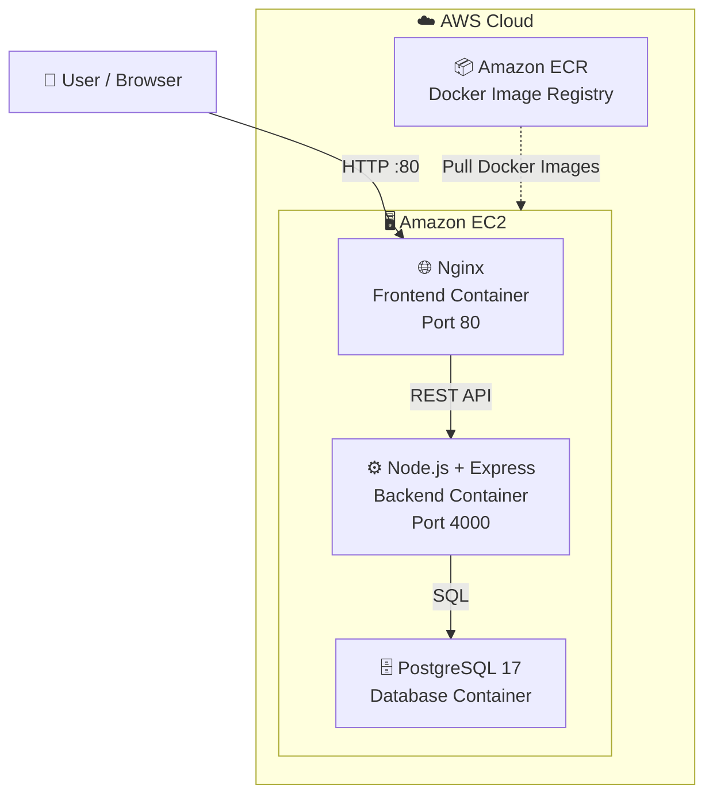
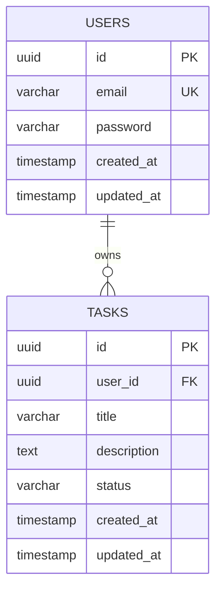
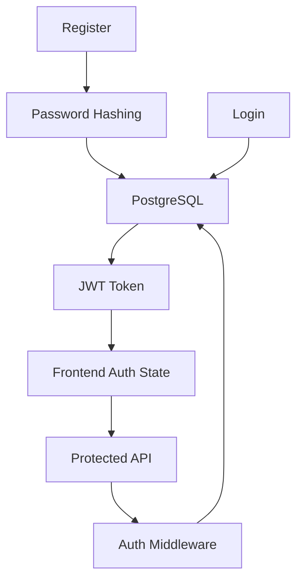
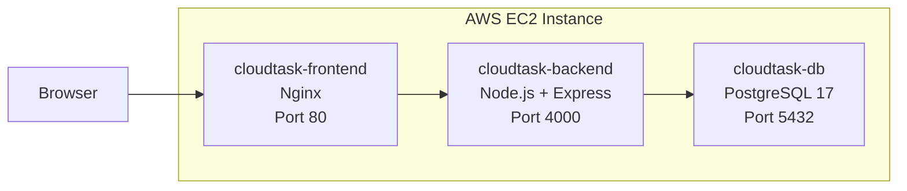
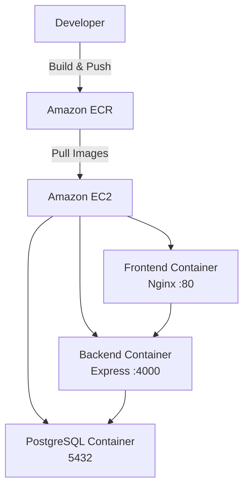

<h1 align="center">☁️ CloudTask</h1>

<p align="center">
  A production-style full-stack task management application built with
  <strong>React, TypeScript, Node.js, Express, PostgreSQL, Docker, and AWS.</strong>
</p>

<p align="center">
  
  
  
  
  
  
</p>

<p align="center">
  <a href="http://3.110.37.65">
    
  </a>
  <a href="https://github.com/Aditya0254-singh/CloudTask">
    
  </a>
</p>

---

CloudTask allows authenticated users to securely register and log in, create and manage personal tasks, and perform complete CRUD operations through a protected REST API.

The application is containerized with Docker and deployed on an AWS EC2 instance using Docker images stored in Amazon ECR.


---

## 🚀 Live Application

<p align="center">
  <a href="http://3.110.37.65">
    
  </a>
</p>

<p align="center">
  🌐 <strong>CloudTask is currently running on AWS EC2</strong>
</p>

> 💡 The EC2 public IP may change if the instance is stopped and started.


---

## ✨ Features

### Authentication

- User registration
- User login
- JWT-based authentication
- Password hashing
- Protected API routes
- Protected frontend routes
- Logout functionality
- Persistent authentication state

### Task Management

Authenticated users can:

- Create tasks
- View tasks
- Edit tasks
- Delete tasks
- Manage only their own tasks
- Refresh the dashboard and retain persisted data

### Backend

- RESTful API
- Express.js
- TypeScript
- PostgreSQL
- JWT authentication
- Centralized error handling
- Environment-based configuration
- Database migrations
- Health check endpoint

### Frontend

- React
- TypeScript
- Vite
- Protected routes
- Authentication context
- Reusable components
- Task management UI
- Loading states
- Error handling

### Deployment

- Docker
- Nginx
- Amazon ECR
- Amazon EC2
- PostgreSQL container
- Dockerized frontend and backend

---

# 🛠️ Technology Stack

| Layer | Technology |
|---|---|
| Frontend | React |
| Frontend Language | TypeScript |
| Frontend Build Tool | Vite |
| Backend | Node.js |
| Backend Framework | Express.js |
| Backend Language | TypeScript |
| Database | PostgreSQL 17 |
| Authentication | JWT |
| Password Security | bcrypt |
| Web Server | Nginx |
| Containerization | Docker |
| Container Registry | Amazon ECR |
| Cloud Platform | AWS EC2 |
| Database Driver | PostgreSQL / pg |
| Package Manager | npm |

---

# 🏗️ System Architecture



### Architecture Flow

```text
                         ☁️ AWS CLOUD
                              │
              ┌───────────────┴───────────────┐
              │                               │
        📦 Amazon ECR                    🖥️ Amazon EC2
        Docker Images                         │
              │                               │
              │ Pull Images                  │
              └──────────────────────►       │
                                              │
                                  ┌───────────┴───────────┐
                                  │                       │
                            🌐 Frontend              ⚙️ Backend
                              Nginx                  Express API
                              :80                      :4000
                                                          │
                                                          │ SQL
                                                          ▼
                                                   🗄️ PostgreSQL
                                                      :5432
```

The user accesses the application through the Nginx frontend container. Nginx serves the React application and forwards API requests to the Node.js/Express backend. The backend communicates with PostgreSQL for persistent data storage.

Amazon ECR acts as the container image registry, while the EC2 instance runs the application containers.

---

# 🖥️ Frontend Architecture

The frontend is built using React and TypeScript with a component-based architecture.

```text
cloudtask-frontend/
│
├── src/
│   ├── api/
│   │   └── client.ts
│   │
│   ├── components/
│   │   ├── LoadingSpinner.tsx
│   │   ├── Modal.tsx
│   │   ├── Navbar.tsx
│   │   ├── ProtectedRoute.tsx
│   │   ├── TaskCard.tsx
│   │   └── TaskForm.tsx
│   │
│   ├── context/
│   │   └── AuthContext.tsx
│   │
│   ├── features/
│   │   ├── auth/
│   │   │   └── authApi.ts
│   │   │
│   │   └── tasks/
│   │       ├── tasksApi.ts
│   │       └── useTasks.ts
│   │
│   ├── pages/
│   │   ├── DashboardPage.tsx
│   │   ├── LoginPage.tsx
│   │   ├── RegisterPage.tsx
│   │   └── NotFoundPage.tsx
│   │
│   ├── types/
│   │   └── index.ts
│   │
│   ├── App.tsx
│   ├── index.css
│   └── main.tsx
│
├── public/
├── Dockerfile
├── nginx.conf
├── package.json
└── vite.config.ts
```

### Frontend Flow

```text
User
  │
  ▼
React Page
  │
  ▼
Component
  │
  ▼
API Hook / Feature API
  │
  ▼
HTTP Client
  │
  ▼
Backend REST API
```

---

# ⚙️ Backend Architecture

The backend follows a modular structure separating routes, controllers, services, repositories, middleware, configuration, and database logic.

```text
cloudtask-backend/
│
├── src/
│   │
│   ├── config/
│   │   ├── db.ts
│   │   └── env.ts
│   │
│   ├── db/
│   │   ├── migrate.ts
│   │   └── migrations/
│   │       ├── 001_create_users.sql
│   │       └── 002_create_tasks.sql
│   │
│   ├── middleware/
│   │   ├── auth.middleware.ts
│   │   └── error.middleware.ts
│   │
│   ├── modules/
│   │   │
│   │   ├── auth/
│   │   │   ├── auth.controller.ts
│   │   │   ├── auth.repository.ts
│   │   │   ├── auth.routes.ts
│   │   │   └── auth.service.ts
│   │   │
│   │   └── tasks/
│   │       ├── tasks.controller.ts
│   │       ├── tasks.repository.ts
│   │       ├── tasks.routes.ts
│   │       └── tasks.service.ts
│   │
│   ├── app.ts
│   └── server.ts
│
├── Dockerfile
├── package.json
└── tsconfig.json
```

---

# 🔌 Backend Request Architecture

```text
HTTP Request
     │
     ▼
   Route
     │
     ▼
 Controller
     │
     ▼
  Service
     │
     ▼
Repository
     │
     ▼
PostgreSQL
     │
     ▼
Repository
     │
     ▼
  Service
     │
     ▼
 Controller
     │
     ▼
 JSON Response
```

### Responsibilities

| Layer | Responsibility |
|---|---|
| Routes | Define API endpoints |
| Controllers | Handle HTTP requests/responses |
| Services | Application/business logic |
| Repositories | Database access |
| Middleware | Authentication and error handling |
| Config | Environment and database configuration |
| Migrations | Database schema creation |

---

# 🗄️ Database Architecture

CloudTask uses PostgreSQL 17 as its relational database.

The database is also containerized using Docker.



### Relationship

```text
Users
  │
  │ 1
  │
  │ owns
  │
  │ N
  ▼
Tasks
```

Each task belongs to a specific authenticated user.

This allows the backend to restrict task operations to the owner of the task.

---

# 🔐 Authentication

CloudTask uses JWT-based authentication.

## Authentication Flow



### Registration

```text
User
  │
  ▼
Register Form
  │
  ▼
POST /api/auth/register
  │
  ▼
Validate Input
  │
  ▼
Hash Password
  │
  ▼
Create User
  │
  ▼
PostgreSQL
```

### Login

```text
User
  │
  ▼
Login Form
  │
  ▼
POST /api/auth/login
  │
  ▼
Find User
  │
  ▼
Compare Password
  │
  ▼
Generate JWT
  │
  ▼
Return Token
  │
  ▼
Frontend
```

### Protected Request

```text
Frontend
   │
   │ Authorization: Bearer <JWT>
   ▼
Express API
   │
   ▼
Authentication Middleware
   │
   ├── Invalid → 401 Unauthorized
   │
   └── Valid
        │
        ▼
     Controller
        │
        ▼
      Service
        │
        ▼
    Repository
        │
        ▼
    PostgreSQL
```

---

# 🔒 Authorization

Authentication and authorization are handled separately.

### Authentication

Determines:

> "Who is this user?"

JWT is used to identify the authenticated user.

### Authorization

Determines:

> "Is this user allowed to access this resource?"

Task operations are associated with the authenticated user's ID.

Therefore a user cannot manage another user's tasks through the protected API.

---

# ❤️ Health API

The backend exposes a health endpoint:

```http
GET /api/health
```

Successful response:

```json
{
  "success": true,
  "message": "CloudTask API is running"
}
```

This endpoint was verified against the deployed EC2 backend.

Example:

```bash
curl http://3.110.37.65:4000/api/health
```

---

# 🔌 REST API

## Health

| Method | Endpoint | Authentication |
|---|---|---|
| GET | `/api/health` | No |

## Authentication

| Method | Endpoint | Authentication |
|---|---|---|
| POST | `/api/auth/register` | No |
| POST | `/api/auth/login` | No |

## Tasks

| Method | Endpoint | Authentication |
|---|---|---|
| GET | `/api/tasks` | JWT |
| POST | `/api/tasks` | JWT |
| PUT | `/api/tasks/:id` | JWT |
| DELETE | `/api/tasks/:id` | JWT |

---

# 🧪 Application Verification

The deployed application was manually tested after deployment.

### Authentication

- [x] User registration
- [x] User login
- [x] Logout
- [x] Login after logout
- [x] Protected dashboard access

### Dashboard

- [x] Dashboard loads
- [x] Create task
- [x] View task
- [x] Edit task
- [x] Delete task
- [x] Refresh dashboard
- [x] Verify task persistence

### Backend

- [x] Backend container running
- [x] Backend health endpoint verified
- [x] Backend API accessible from the internet
- [x] PostgreSQL container running
- [x] Frontend container running

### Deployment

- [x] Docker images built
- [x] Images pushed to Amazon ECR
- [x] Images pulled from Amazon ECR
- [x] Frontend deployed on EC2
- [x] Backend deployed on EC2
- [x] PostgreSQL deployed as Docker container

---

# 🐳 Docker Architecture

CloudTask runs as multiple Docker containers.



### Running Containers

```text
cloudtask-frontend
        │
        │ Port 80
        ▼
cloudtask-backend
        │
        │ Port 4000
        ▼
cloudtask-db
        │
        │ PostgreSQL 5432
        ▼
    Database
```

PostgreSQL is kept inside the Docker environment rather than exposed directly to the public internet.

---

# ☁️ AWS Deployment Architecture



---

# 📦 Deployment Flow

```text
Local Development
       │
       ▼
Docker Build
       │
       ▼
Amazon ECR
       │
       ▼
AWS EC2
       │
       ▼
Docker Pull
       │
       ▼
Docker Containers
       │
       ├── Frontend
       ├── Backend
       └── PostgreSQL
       │
       ▼
Live Application
```

---

# 🌐 Network Configuration

The EC2 security group allows the required application traffic.

| Port | Protocol | Purpose |
|---|---|---|
| 80 | TCP | Frontend / HTTP |
| 4000 | TCP | Backend API |
| 22 | TCP | SSH administration |
| 5432 | TCP | PostgreSQL internal container communication |

The PostgreSQL database is not intended to be publicly exposed.

---

# 🐳 Docker Images

Two application images are maintained:

```text
cloudtask-frontend
cloudtask-backend
```

The images are stored in Amazon ECR and pulled by the EC2 instance during deployment.

---

# 🏠 Local Development

## Prerequisites

Install:

- Node.js
- npm
- PostgreSQL or Docker
- Git
- Docker Desktop (recommended)

---

# 📥 Clone Repository

```bash
git clone https://github.com/Aditya0254-singh/CloudTask.git

cd CloudTask
```

---

# ▶️ Run Backend Locally

```bash
cd cloudtask-backend
npm install
```

Create a `.env` file based on:

```text
.env.example
```

Then run the backend using the project's configured npm scripts.

The backend will expose:

```text
http://localhost:4000
```

Health check:

```bash
curl http://localhost:4000/api/health
```

Expected response:

```json
{
  "success": true,
  "message": "CloudTask API is running"
}
```

---

# ▶️ Run Frontend Locally

Open another terminal:

```bash
cd cloudtask-frontend
npm install
```

Configure the frontend environment using:

```text
.env.example
```

Then start the Vite development server using the project's configured npm script.

---

# 🐘 Database Migrations

The backend contains SQL migration files:

```text
cloudtask-backend/src/db/migrations/

001_create_users.sql
002_create_tasks.sql
```

The migration runner is located at:

```text
cloudtask-backend/src/db/migrate.ts
```

The migrations establish the core database schema required by CloudTask.

---

# 📁 Complete Project Structure

```text
CloudTask/
│
├── README.md
├── .gitignore
│
├── cloudtask-backend/
│   │
│   ├── src/
│   │   ├── config/
│   │   │   ├── db.ts
│   │   │   └── env.ts
│   │   │
│   │   ├── db/
│   │   │   ├── migrate.ts
│   │   │   └── migrations/
│   │   │       ├── 001_create_users.sql
│   │   │       └── 002_create_tasks.sql
│   │   │
│   │   ├── middleware/
│   │   │   ├── auth.middleware.ts
│   │   │   └── error.middleware.ts
│   │   │
│   │   ├── modules/
│   │   │   ├── auth/
│   │   │   │   ├── auth.controller.ts
│   │   │   │   ├── auth.repository.ts
│   │   │   │   ├── auth.routes.ts
│   │   │   │   └── auth.service.ts
│   │   │   │
│   │   │   └── tasks/
│   │   │       ├── tasks.controller.ts
│   │   │       ├── tasks.repository.ts
│   │   │       ├── tasks.routes.ts
│   │   │       └── tasks.service.ts
│   │   │
│   │   ├── app.ts
│   │   └── server.ts
│   │
│   ├── Dockerfile
│   ├── package.json
│   └── tsconfig.json
│
└── cloudtask-frontend/
    │
    ├── src/
    │   ├── api/
    │   │   └── client.ts
    │   │
    │   ├── components/
    │   │   ├── LoadingSpinner.tsx
    │   │   ├── Modal.tsx
    │   │   ├── Navbar.tsx
    │   │   ├── ProtectedRoute.tsx
    │   │   ├── TaskCard.tsx
    │   │   └── TaskForm.tsx
    │   │
    │   ├── context/
    │   │   └── AuthContext.tsx
    │   │
    │   ├── features/
    │   │   ├── auth/
    │   │   │   └── authApi.ts
    │   │   └── tasks/
    │   │       ├── tasksApi.ts
    │   │       └── useTasks.ts
    │   │
    │   ├── pages/
    │   │   ├── DashboardPage.tsx
    │   │   ├── LoginPage.tsx
    │   │   ├── RegisterPage.tsx
    │   │   └── NotFoundPage.tsx
    │   │
    │   ├── types/
    │   │   └── index.ts
    │   │
    │   ├── App.tsx
    │   ├── index.css
    │   └── main.tsx
    │
    ├── Dockerfile
    ├── nginx.conf
    ├── package.json
    └── vite.config.ts
```

---

# 🔐 Environment Variables

Environment-specific values are intentionally excluded from version control.

The repository contains:

```text
.env.example
```

while actual `.env` files are ignored using `.gitignore`.

Never commit:

```text
.env
```

or other secrets such as:

```text
*.pem
```

---

# 🛡️ Security Considerations

CloudTask implements several basic application security practices:

- JWT-based authentication
- Password hashing
- Protected API routes
- Protected frontend routes
- User-specific task authorization
- Environment variables for configuration
- `.env` excluded from Git
- Database not intended for public access
- EC2 security group controls inbound traffic

For a production system, additional hardening would be recommended, including:

- HTTPS/TLS
- Secure cookie-based token storage
- Rate limiting
- Request validation
- Security headers
- Centralized logging
- Secret management
- Automated backups
- Monitoring and alerting

---

# 📊 Architecture Summary

| Component | Responsibility |
|---|---|
| React | User interface |
| TypeScript | Static typing |
| Vite | Frontend development/build |
| Nginx | Serves frontend |
| Node.js | Backend runtime |
| Express | REST API |
| JWT | Authentication |
| bcrypt | Password hashing |
| PostgreSQL | Persistent data |
| Docker | Containerization |
| Amazon ECR | Container image registry |
| Amazon EC2 | Application hosting |

---

# 🎯 Design Goals

CloudTask was designed around several practical full-stack engineering principles:

### Separation of Concerns

Frontend, backend, authentication, database access, and deployment concerns are separated.

### Modular Backend

Authentication and task management are organized into independent modules.

### Reusable Frontend Components

Common UI functionality is extracted into reusable React components.

### Protected Resources

Task resources are associated with authenticated users.

### Containerized Deployment

Application components are packaged into Docker containers for consistent deployment.

### Environment-Based Configuration

Configuration and secrets are separated from application source code.

---

# 🚀 Future Improvements

Potential improvements include:

- HTTPS with a domain name
- AWS Application Load Balancer
- AWS RDS PostgreSQL
- CI/CD using GitHub Actions
- Automated Docker image builds
- Automated EC2 deployment
- Refresh-token authentication
- Rate limiting
- API documentation with Swagger/OpenAPI
- Automated unit and integration tests
- AWS CloudWatch monitoring
- Centralized application logging
- Task filtering and search
- Task priorities
- Task due dates
- Task categories
- Pagination

---

# 📌 Project Status

**Status: Deployed and Functional**

The current deployed version supports:

- User registration
- User login
- Logout
- Protected dashboard
- Task creation
- Task editing
- Task deletion
- Task persistence
- REST API
- PostgreSQL database
- Docker deployment
- AWS EC2 hosting
- Amazon ECR image storage
- Backend health monitoring

---

# 👨‍💻 Author

**Aditya Singh**

GitHub:  
https://github.com/Aditya0254-singh

LinkedIn:  
https://www.linkedin.com/in/aditya-singh-baa980257

---

# ⭐ CloudTask

A practical full-stack application demonstrating:

**React + TypeScript + Node.js + Express + PostgreSQL + JWT + Docker + AWS**

Built from development to deployment with a complete frontend, backend, database, authentication system, containerized infrastructure, and cloud deployment.
